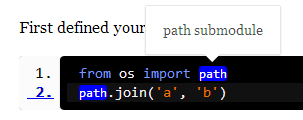

Parm Introduction
===================

Convert par favorit markdown syntax to html document, supports semantic-ui and
bootstrap css framework.

## Installation

First install par and parm to your box.

```
pip install parm
```

Then writing your markdown documents. For example write it in:

```
/project/docs
```

## Initialize Environment

Next, change to docs folder. If you are run the first time, you should initialize
parm project environment, just like:

```
parm init
```

When running this command, it'll may ask if you want to initialize the config
information, if you choice `Y`, then you will enter interactive command line,
then just input some infos, and you can change them later in `conf.py` file.
And parm will use it to convert the markdown documents.

This command will copy some static files and templates from parm module. But
you don't need to care about them now.

For 0.9 version, it'll also copy a demo pages such as : index.md, introduction.md,
so you can directly run `parm make` and see the result.

## Writing TOC

Next, you can start to convert the docs. Because parm support table of content(TOC), so
you can write your topic content in `index.md` file. For 0.9 version, it'll already
created a index.md for you, so you can just open and edit it.

The content just like:

```
## Introduction


file1.md
file2.md
...

```

For 0.9 version, you shouldn't need H1 subject, because the project info is already
written in conf.py, and you can change them.

You should put all files which you can to be listed in `toc` tag. And you can
also set `max_depth` argumant, and it means the heading level of each markdown
file, such as `h1`, `h2`, .etc. You can also skip `max_depth` the default will
be `1`.

You can put multiple toc section in index.md, and also give a H2 subject for each.

## Build

And you can run:

```
parm make
```

to start converting.

And when the convert finished, the result will be output to `html` default.
You can also change it with `-d` parameter, just like:

```
parm make -d output_directory
```

and the result will be outputed to  `output_directory`.

## Convert reStructuredText to Markdown

parm also supports convert reStructuredText format to Markdown format. Just
enter your doc directory, and execute below command:

```
parm rst2md <output_directory>
```

But you known, reStructuredText format is rich than markdown, so I expand some
new style for Markdown format in [par](https://github.com/limodou/par) project.
But there are still some styles unsupported by par, so you need to change them
manually.

And if you want to convert reStructuredText to Markdown, you should install
`docutils` first.

Just try it, hope you enjoy it.

## About rst2md writer

I found there is a project https://github.com/cgwrench/rst2md in github, and I
changed the code from it in order to suit the style format of `par`. But I found
rst2md seem not so matual enough.

## How to add disqus support

When initialized the parm project, it'll copy some templates and static files. You may
want to add disqus support to each page. So let me show you how to do that.

### Sign in Disqus and got embeded codes

For 0.9 version, parm has already supported disqus, so when you created conf.py
it'll ask you the disqus account name, and the name will be saved in conf.py, so
you can edit it later. And steps below will not need, but you should know how
to config it if you want to change it later.

You should sign in disqus first, and then you'll get two paragraphs, one is
html code, the other is js code. For example:

**html code**

```
<div id="disqus_thread" style="margin:20px;"></div>
 <script type="text/javascript">
     /* * * CONFIGURATION VARIABLES: EDIT BEFORE PASTING INTO YOUR WEBPAGE * * */
     var disqus_shortname = 'YOUR_SITE_SHORT_NAME'; // required: replace example with your forum shortname

     /* * * DON'T EDIT BELOW THIS LINE * * */
     (function() {
         var dsq = document.createElement('script'); dsq.type = 'text/javascript'; dsq.async = true;
         dsq.src = 'http://' + disqus_shortname + '.disqus.com/embed.js';
         (document.getElementsByTagName('head')[0] || document.getElementsByTagName('body')[0]).appendChild(dsq);
     })();
 </script>
 <noscript>Please enable JavaScript to view the <a href="http://disqus.com/?ref_noscript">comments powered by Disqus.</a></noscript>
 <a href="http://disqus.com" class="dsq-brlink">comments powered by <span class="logo-disqus">Disqus</span></a>
```

**js code**

```
<script type="text/javascript">
   /* * * CONFIGURATION VARIABLES: EDIT BEFORE PASTING INTO YOUR WEBPAGE * * */
   var disqus_shortname = 'YOUR_SITE_SHORT_NAME'; // required: replace example with your forum shortname

   /* * * DON'T EDIT BELOW THIS LINE * * */
   (function () {
       var s = document.createElement('script'); s.async = true;
       s.type = 'text/javascript';
       s.src = 'http://' + disqus_shortname + '.disqus.com/count.js';
       (document.getElementsByTagName('HEAD')[0] || document.getElementsByTagName('BODY')[0]).appendChild(s);
   }());
   </script>
```

And you should replace two `YOUR_SITE_SHORT_NAME` according your account of disqus.

For 0.9 version, you can just replace `disqus` config variable, it's enough.

Above codes is already saved in `conf.py`, for example:

```
#disqus
disqus_text = '''
...<first paragraph>
'''

disqus_js = '''
...<second paragraph>
'''
```

### Change layout.html

Open the template file `your_parm_project/templates/layout.html` and change two
places:

After

```
<div class="source">
    <i class="icon-download"></i>{{<< source}}
</div>
```

add:

```
<!-- disqus -->
{{<< conf.disqus_text}}
```

And before

```
</body>
```

add:

```
{{<< conf.disqus_js}}
```

When after above works, execute `parm make -d output_directory` again.

For 0.9 version, above code is already existed in `layout.html` template.

## Change Index Introduction Info

Introduction is a pagagraph to show the project title and summary infos, you can
change it in conf.py:

```
introduction = u'''
<h1 class="ui header">%s
<a class="ui black label">%s</a>
</h1>
<h2 class="ui header">Your project shows description here.</h2>
''' % (project, version)
```

## About theme

For 0.8 version, parm is already support two themes: bootstrap, semantic. But I
prefer the semantic, because I made more care about it. If you want to change
the theme, you can just change :

```
theme = 'semantic'
```

## Menu Navigation

Default menu navigation has only home entry, you can change it in conf.py according
the description:

```
menus = [
    ('home', 'Home', 'index.html'),
]
```

## How to exclude files

In 0.9 version, after you've initialized parm project, there should be an exclude.txt
file, you can change it to exclude the files or directories which you don't want
to copy to output directory. One pattern could be in one line. The pattern just
like filename matching pattern, for example, these are available patterns:

```
conf.py
*.pyc
templates
```

## How to host your docs in github pages

1. clone your project to a new directory, for example `yourproject-doc`
2. `git checkout --orphan gh-pages`
3. `git rm -rf .`
4. create docs in your repo, and write your docs
5. render html to doc directory, for example the directory will be:

    ```
    project(master)\
       docs\  <------you are here
    project-doc(gh-pages)\
    ```

    ```
    parm make -d ../../yourproject-doc
    ```
6. in yourproject-doc, `git add .`
7. `git commit -a -m "init doc"`
8. `git push origin gh-pages`
9. Visit your doc in `http://yourname.github.io/yourproject`

You could also see the documentation https://help.github.com/articles/creating-project-pages-manually
to understand how to use `gh-pages`.

## Markdown Extensions

Parm add some markdown extension, the TOC support is one of them, others are:

### Code Comment

The Syntax like this:

```

key : value
key : value
    
```

For `target` will be the target element selector, it could be `<pre>` or element id.

And `key` can be lineno or keywords defined in code, and this will display an label
and when you move mouse on it, it'll display a tip the content comes from `value`.

For example:

First defined your code like this:

<code>
```id=test,class=linenums
from os import path
path.join('a', 'b')
```
</code>

Then define code comment like this:

```

path : path submodule
2 : line 2

```

And the result should be:



So you can see a popup will shown when your mourse hover specified lineno or keyword.


### include file

Sometimes you need to show some codes, one way you can type them in document directly, using
<code>```</code>, .etc. But in Parm, you can also include code from a source file,
so this feature will be very handy, and even the code is changed, you don't need
to care about the code sync, just recreate the doc again. 
And you can use `include` to do this thing.

The basic syntax of `include` tag should be:

```

lines_content

```

file (must)
:   source filename, it's path will be relative with current markdown doc file

lines (optional)
:   defines the range of lines in source file, it can be several ranges like this:

    ```
    1-20 30-
    ```
    
    Above means the line 1<= lineno <= 20 and 30 <= lineno will be included.
    
    So if you ommit `lines` at all, the whole file will be included.
    
    ```
    2 5
    ```
    
    It is also right syntax. Just they are the simple line patterns.
    
language (optional)
:   Specify the language. 

class (optional)
:   Extra `class` attribute will be add to `<pre>` tag. If you want Parm show
    lineno, you should use `class=linenums` . This class used in google highlight
    js lib.

lines_content (optional)
:   If you don't want to use lineno specifing the range of code lines, you can also
    use regular expression, so just defined it in lines_content.
    
    The format is:
    
    ```
    begin_regular_expression...begin_regular_expression
    ```
    
    The `...` is used to separate `begin` regular expression and `end` regular expression.
    Only one of them could be ommitted. And the line that matching `begin` or 
    `end` pattern will be included in the output, so if you want to skip them, 
    you can add `!` at the end of the pattern.
    
    For example, the file content is:
    
    ```
    $(function(){
        $('.div').on('click', function(e){
            e.preventDefault();
            $.ajax({
                url:'/test',
                dataType:'json',
                success:function(result){
                    show_message(result);
                }
            });
        });
    });
    ```
    
    ```
    
    \$\('\.div'\)...\$\.ajax
    
    ```
    
    will show the lines like:
    
    ```
        $('.div').on('click', function(e){
            e.preventDefault();
            $.ajax({
    ```
    
    But,
    
    ```
    
    \$\('\.div'\)!...\$\.ajax!
    
    ```
    
    will only show the lines like:
    
    ```
            e.preventDefault();
    ```
    
## License

This software is released under BSD license.

## DEMO

You can see: http://limodou.github.io/parm or http://limodou.github.io/uliweb-doc